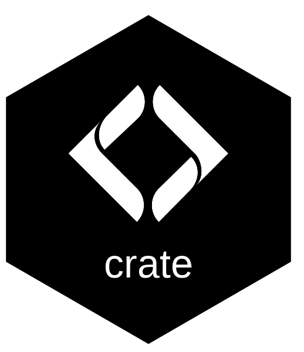

# crate 

> Stable file readers for shape-shifting data sources.

When external data we depend on changes shape — columns renamed, types swapped, layouts flipped — code that reads those files breaks. crate is the one place that knows about all the shape variations.

Call `crt_ingest("source", "file_name", path)` from anywhere. Same call, same output, regardless of which version of the upstream file landed. When upstream changes shape again, fix it once in crate; everywhere downstream keeps working.

Some data crate should not read — a spatial format, a database, an API. For that, `crt_schema_conform(df, "source", "file_name")` takes a data frame you already have and holds it to the same declared shape. crate says what the columns mean either way; reading the bytes is somebody else's job.

## Installation

```r
pak::pak("NewGraphEnvironment/crate")
```

## Example

[bcfishpass](https://github.com/smnorris/bcfishpass) changed `user_habitat_classification.csv` between commit `9cc30fc` (long format with text `habitat_ind` indicators) and commit `40c4a0a` (wide format with integer `spawning` + `rearing` columns) on 2026-04-26. The reshape included both a structural change (one column → two) and a type change (text → integer). crate handles both shapes:

```r
library(crate)

# What does crate know about?
crt_files()
#> # A tibble: 5 × 6
#>   source file_name                   kind        handler_fn                schema_yaml
#>   <chr>  <chr>                       <chr>       <chr>                     <chr>
#> 1 bcfp   user_habitat_classification file        crt_handler_bcfp_user_ha… schemas/bcfp/user_habitat_classification.yaml
#> 2 nge    track_sessions              schema_only NA                        schemas/nge/track_sessions.yaml
#> 3 nge    track_vertices              schema_only NA                        schemas/nge/track_vertices.yaml
#> 4 nge    track_annotations           schema_only NA                        schemas/nge/track_annotations.yaml
#> 5 nge    form_capture                schema_only NA                        schemas/nge/form_capture.yaml

# Ingest a bundled wide-format example fixture (today's upstream shape)
wide_path <- system.file(
  "extdata/examples/bcfp/user_habitat_classification_wide.csv",
  package = "crate"
)
wide <- crt_ingest("bcfp", "user_habitat_classification", wide_path)

# Ingest the bundled long-format historical fixture — same call,
# crate pivots it to canonical wide automatically
long_path <- system.file(
  "extdata/examples/bcfp/user_habitat_classification_long.csv",
  package = "crate"
)
long <- crt_ingest("bcfp", "user_habitat_classification", long_path)

# Both calls return the same canonical column set
identical(names(wide), names(long))
#> [1] TRUE
```

When the next upstream reshape happens, the fix is one PR in crate — register the new shape as an `upstream_variant` in the schema YAML and add a small pivot function. Code calling `crt_ingest()` doesn't change.

See the [function reference](https://newgraphenvironment.github.io/crate/reference/) and [browse the schemas](https://github.com/NewGraphEnvironment/crate/tree/main/inst/extdata/schemas).

## How it works

When you call `crt_ingest("bcfp", "user_habitat_classification", path)`, five pieces wire together at runtime:

1. **Registry** ([`inst/extdata/crate_registry.csv`](inst/extdata/crate_registry.csv)) — a CSV mapping each `(source, file_name)` pair to a handler function name and a schema YAML path. crate looks up "what do I know about this file?" here. Loaded by `crt_registry_load()`.

2. **Schema YAML** ([`inst/extdata/schemas/bcfp/user_habitat_classification.yaml`](inst/extdata/schemas/bcfp/user_habitat_classification.yaml)) — declares the canonical column shape (names, types, required flags) AND each known upstream variant (a column-name set + a normalize-function id). Loaded by `crt_schema_read()`.

3. **Handler** ([`R/crt_handler_bcfp_user_habitat_classification.R`](R/crt_handler_bcfp_user_habitat_classification.R)) — one function per `(source, file_name)`. crate matches the actual file columns against each variant's declared columns (first set-equal match wins), then dispatches the matched `variant_id` into the handler:
   - `2026-04-26-wide` → identity passthrough (already canonical)
   - `pre-2026-04-26-long` → pivot long rows to wide canonical, mapping `habitat_ind` text values to integer indicators

4. **Validation** (`crt_schema_validate()`) — after the handler returns, crate checks every column declared `required: true` in the schema is present. Fails loud listing all missing required columns.

5. **Type enforcement** (`crt_schema_apply()`) — finally, crate coerces every named column to the type declared in the schema (`integer`, `double`, `string`, `logical`, `datetime`). Schema YAML is the single source of truth for types; handlers don't encode type knowledge. Without this, readr's defaults leak through (integer cols become double, declared strings become Date).

Steps 4 and 5 are `crt_schema_conform()`, which `crt_ingest()` calls rather than reimplements — so a file and a frame you supply yourself get identical treatment.

A `datetime` column is **an instant**, and crate never moves it. A `POSIXct` has its timezone attribute *stamped* to UTC rather than converted: several readers return correct UTC instants carrying no timezone label, so R renders them in the session's zone and they read as a second clock in a second timezone. Converting to "fix" that rendering injects a real whole-hour error into every join downstream. Stamping fixes the label, which was the only thing wrong.

The handler made the type change transparent in our example. The wide canonical declares `spawning` and `rearing` as integer columns; the long upstream had `habitat_ind` as text (`"t"`/`"f"`). The pivot does the text→integer conversion in the same step as the long→wide reshape — callers never see either intermediate form. Type enforcement (step 5) catches any leaks at the boundary regardless of handler.

### Naming convention

Every function in crate's namespace starts with `crt_`, family-namespaced:

- `crt_<verb>` — public singletons (`crt_ingest`, `crt_files`)
- `crt_schema_conform` — public, and in the `crt_schema_*` family because that is what it belongs to
- `crt_handler_<source>_<file_name>` — per-(source, file) dispatchers
- `crt_<family>_<verb>` — internal helper families (`crt_registry_*`, `crt_schema_*`)

Reserved future families (slots in the `crt_schema_*` family for the schema-as-contract roadmap): `crt_schema_version`, `crt_schema_migrate`, plus future `cols[].range`, `cols[].enum`, `cols[].predicate` extensions to `crt_schema_validate`.

### Caveat: variant matching is column-names only

`crt_ingest()` matches input to upstream variants by exact column-name set equality. It does not validate column types at the variant-match step. If upstream later ships the same column names with different types, the handler would receive misshapen data; `crt_schema_apply()` then coerces the output (some coercions silently produce NAs, e.g., `as.integer("yes")` → NA). Type-aware variant matching (declaring `cols: [{name, type}]` and validating both at dispatch) is a planned v0.1.x improvement.

Output types and required-cols ARE enforced via `crt_schema_apply()` and `crt_schema_validate()` respectively (steps 4–5 above).

### Adding a new (source, file_name) pair

1. Author the schema YAML at `inst/extdata/schemas/<source>/<file_name>.yaml`
2. Write a normalize handler at `R/crt_handler_<source>_<file_name>.R`
3. Add a row to [`inst/extdata/crate_registry.csv`](inst/extdata/crate_registry.csv)
4. Write a decision-log entry at `decisions/<source>/<YYYYMMDD>_<topic>.md` if the canonical-shape choice isn't self-evident
5. Add tests + small synthetic fixtures at `inst/extdata/examples/<source>/<file_name>_<variant>.csv`

See [`inst/extdata/schemas/README.md`](inst/extdata/schemas/README.md) and [`decisions/README.md`](decisions/README.md) for the conventions on each.

## What crate handles today

Entries come in two kinds. `file` entries crate reads and normalizes; `schema_only` entries declare a canonical shape for data crate does not read, which you conform yourself with `crt_schema_conform()`.

**`file`**

- `bcfp` (files from [smnorris/bcfishpass](https://github.com/smnorris/bcfishpass))
  - `user_habitat_classification` — handles both pre-2026-04-26 long and current 2026-04-26 wide upstream variants

**`schema_only`**

- `nge` — GPS tracks
  - `track_sessions` — one row per tracking session, carrying the evidence that its two clocks agree, and what the crew said about the session when they walked it (`track_name`, `track_type`, `track_description`, `named_by` — optional, because not every capture source has them)
  - `track_vertices` — one row per recorded position; non-spatial, so the geometry is reconstructable without a spatial dependency in the read path
  - `track_annotations` — overrides for the crew-supplied columns, deliberately a separate table. Captured tables are immutable and a harvest only ever writes those, so a correction lives beside them; a non-key column here sharing a captured column's name overrides it where non-`NA`. Keyed with a timestamp fingerprint so a reissued identifier fails loudly instead of silently renaming somebody else's track. See the decision entries on [the two-table shape](decisions/nge/20260824_track_canonical_two_tables.md) and [captured naming and overrides](decisions/nge/20260902_track_naming_captured_and_overridden.md).
- `nge` — field forms
  - `form_capture` — the envelope every captured field-form record carries (`project`, `form`, `record_id`, `source_version`, `schema_version`, `captured_at`), saying where a record came from and in what shape, and nothing about what any observation means. See the [decision entry](decisions/nge/20260901_form_capture_envelope.md).

More land as integration work surfaces. Each addition = a YAML in `inst/extdata/schemas/` + a registry row, plus a handler when crate does the reading. See [`inst/extdata/schemas/README.md`](inst/extdata/schemas/README.md) for the format.

## Sibling public packages

[fresh](https://github.com/NewGraphEnvironment/fresh), [link](https://github.com/NewGraphEnvironment/link), [flooded](https://github.com/NewGraphEnvironment/flooded), [gq](https://github.com/NewGraphEnvironment/gq), [fpr](https://github.com/NewGraphEnvironment/fpr), [ngr](https://github.com/NewGraphEnvironment/ngr).

